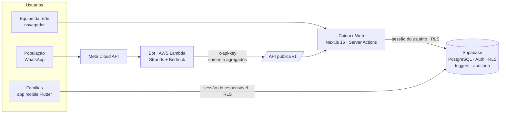

# Cuidar+ · IntegraTEA Crateús

**Sistema informatizado de gestão do cuidado a pessoas com Transtorno do Espectro Autista (TEA) na rede pública de Crateús-CE.**

Solução desenvolvida no **Hackathon BNB – Desafio Prefeitura de Crateús** (Fórum de Inovação e Tecnologia · UFC Campus Crateús · 16 e 17/09/2026), para o tema proposto pela Secretaria Municipal de Saúde e pela SEPLATI.

**🌐 Sistema em produção: [cuidarmais.projetarsolucoes.com](https://cuidarmais.projetarsolucoes.com)**  
**📱 App das famílias (Android): [baixar o APK em Releases](https://github.com/ProjetAR-ce/cuidar-mais-integratea/releases/latest)**

**📄 Documento técnico-funcional (PDF):** [docs/Cuidar+_Guia_do_Sistema_IntegraTEA.pdf](docs/Cuidar+_Guia_do_Sistema_IntegraTEA.pdf) · **Telas do app:** [docs/app/](docs/app)

> Todos os dados deste repositório e do ambiente de demonstração são **fictícios** (RN-014).

---

## O problema

Hoje NASF, NAPE, CREAES, Casa Mais Azul e CRASF registram o cuidado principalmente em papel. Cada serviço tem sua própria ficha e sua própria fila. Por isso ninguém sabe ao certo quem já está sendo atendido, em qual fila, por qual especialidade, nem qual é o próximo passo. Há cadastros repetidos, atendimentos duplicados, encaminhamentos sem resposta e nenhum indicador confiável.

## A solução

Uma plataforma de **coordenação do cuidado** (não é prontuário hospitalar) com três partes que usam o mesmo banco:

| Parte | Pasta | Para quem |
|---|---|---|
| **Sistema web Cuidar+** (Next.js) | [`web/`](web) | recepção, profissionais, coordenação, gestão e administração dos 5 serviços |
| **Aplicativo mobile** (Flutter) | [`mobile/`](mobile) | famílias e responsáveis: jornada, fila, consultas, plano, encaminhamentos, avisos e notícias |
| **Assistente de WhatsApp** (Python · AWS Strands · Bedrock) | [`bot/`](bot) | população em geral |
| **Banco, regras e segurança** (Supabase/PostgreSQL) | [`supabase/`](supabase) | tudo acima |

### ✨ Destaque: da ficha em papel para o digital em segundos

Hoje as fichas da rede são **em papel**. No Cuidar+, basta **fotografar a ficha com o celular**:

1. **Foto ou PDF** da ficha (NASF A.1, anamneses e fichas do NAPE) em *Pacientes → Digitalizar ficha em papel*.
2. **Leitura por IA** (Claude com visão, saída estruturada) em cerca de 20 segundos: nome, nascimento, mãe, CNS, CPF, endereço, responsável, escola e H.D.
3. **Tela de revisão lado a lado com a foto:** campos duvidosos ficam em amarelo, e CNS/CPF/datas são conferidos automaticamente.
4. **Salvar só após conferência humana**, com a mesma checagem de duplicidade do cadastro manual. A origem fica registrada na linha do tempo, a **foto não é armazenada** e a recepção não recebe a hipótese diagnóstica.

Para testar: imprima ou envie [`docs/demonstracao/ficha-nasf-preenchida.pdf`](docs/demonstracao/ficha-nasf-preenchida.pdf), ou preencha à mão a [ficha em branco](docs/demonstracao/ficha-nasf-em-branco.pdf).

### As 4 necessidades do edital

| Necessidade (edital, item 3) | Como o Cuidar+ resolve |
|---|---|
| **1. Gestão informatizada das filas multidisciplinares** | Fila por serviço e especialidade. A ordem soma pontos de prioridade (P1 Urgente, P2 Curto prazo, P3 Lista de espera) e dias de espera, e **cada posição mostra o motivo**. Há agendamento direto da fila e painel de capacidade × demanda. |
| **2. Identificação de duplicidade** | Busca obrigatória antes do cadastro, CNS/CPF únicos e **detecção por semelhança** (nome, nascimento e mãe, tolerante a erros de digitação e acentos). A fusão só ocorre com revisão humana e fica auditada. Alerta de **sobreposição** quando a mesma especialidade está ativa em dois serviços. |
| **3. Registro sistemático e contínuo** | Cadastro único com todos os campos da ficha do NASF (A.1), triagem, encaminhamentos, agenda com **presença/falta/justificativa**, registro de sessão com nº da sessão (A.5) e **linha do tempo** gerada automaticamente. Nada é apagado: correções viram novas versões. |
| **4. Integração entre os serviços** | Linha do tempo única entre os 5 serviços, encaminhamentos com aceite/devolução/complemento, **plano de cuidado compartilhado** com responsável e prazo, alertas de cuidado fragmentado e API pública versionada. |

Mapa completo requisito por requisito: **[docs/CONFORMIDADE_EDITAL.md](docs/CONFORMIDADE_EDITAL.md)**.

---

## Funcionalidades

- **Início por perfil:** indicadores, jornada do cuidado, próximos atendimentos, alertas, rede de serviços e metas do dia.
- **Pacientes:** busca tolerante a erros (CNS, CPF, nome, mãe, responsável), cadastro em 3 etapas com verificação de duplicidade em tempo real, ficha completa, informação clínica protegida, linha do tempo, plano, agenda, encaminhamentos e alertas.
- **Digitalização de fichas em papel:** fotografe a ficha (NASF/NAPE) com o celular. A IA lê os campos, marca o que ficou duvidoso e abre uma **tela de revisão lado a lado com a foto**. Nada é salvo sem conferência humana, a checagem de duplicidade continua valendo e a foto não é armazenada. Ficha simulada para teste em [`docs/demonstracao/`](docs/demonstracao).
- **Triagem:** necessidade, especialidade, prioridade com **justificativa obrigatória** e entrada automática na fila.
- **Fila:** posição explicável, métricas, capacidade, agendar, mudar prioridade (com justificativa), concluir e cancelar (com motivo).
- **Agenda:** dia e semana, presença em um toque, falta justificada ou não, reagendar, cancelar e registrar a sessão.
- **Encaminhamentos:** recebidos e enviados, prazo de resposta, aceitar (com entrada na fila do destino), devolver, pedir complemento e reenviar.
- **Alertas automáticos** (AL-01 a AL-06): duplicidade, sobreposição, encaminhamento parado, 3 faltas seguidas, cuidado sem atualização e fila acima da capacidade. Cada um traz motivo, ação recomendada e revisão registrada.
- **Duplicidades:** comparação lado a lado e unificação sem perda de histórico.
- **Capacidade:** demanda × vagas × espera × profissionais por serviço e especialidade, com gargalos destacados.
- **Indicadores:** comparecimento, faltas, encaminhamentos, tempo de resposta, busca antes do cadastro, gráficos com visão em tabela e **exportação CSV só com dados agregados**.
- **Auditoria:** acessos, consultas sensíveis, alterações, fusões, exportações e tentativas negadas.
- **Administração:** usuários e perfis, serviços e capacidade, parâmetros da rede (pontos de prioridade, prazos, faltas).
- **API pública v1** e **assistente de WhatsApp**.

## Perfis de acesso

| Perfil | Vê e faz |
|---|---|
| Recepção | busca, cadastro, agenda e presença; **sem conteúdo clínico** |
| Profissional | triagem, atendimento, encaminhamento e jornada do seu serviço |
| Coordenação | toda a rede: filas, alertas, duplicidades, planos |
| Gestão | **somente indicadores agregados** e capacidade |
| Administração | usuários, serviços, parâmetros e auditoria |
| Responsável | aplicativo mobile, apenas os próprios dependentes |

A regra vale no **banco (RLS)**, não só na tela.

---

## Arquitetura



- **Regras de negócio no banco:** RPCs `security definer` com checagem de perfil, triggers para linha do tempo, versões, auditoria e alertas, e views para a fila priorizada.
- **Segredos só no servidor:** a chave secreta do Supabase nunca vai ao navegador. O bot usa uma chave de API própria, de escopo público.

Detalhes: [docs/PLANO_DESENVOLVIMENTO.md](docs/PLANO_DESENVOLVIMENTO.md) · [docs/API.md](docs/API.md) · [docs/LGPD.md](docs/LGPD.md).

## Stack

**Web:** Next.js 16 (App Router, Turbopack), React 19, TypeScript, Tailwind CSS 4, Radix UI, Motion, Recharts, Zod, Sonner, cmdk.
**IA:** Claude (Anthropic) com visão para ler fichas em papel, com saída estruturada e revisão humana obrigatória.
**Dados:** Supabase (PostgreSQL 17, Auth, RLS), pg_trgm e unaccent.
**App:** Flutter 3.44, Dart, supabase_flutter.
**Bot:** Python 3.12, Strands Agents, Amazon Bedrock, AWS Lambda, SQS, DynamoDB (SAM).
**Qualidade:** Playwright + axe-core (WCAG 2.2 AA), ESLint (regras do React Compiler), testes SQL em PGlite e unittest no bot e testes do app em Flutter.

---

## Como rodar

### 1. Banco (Supabase)

No SQL Editor do projeto, rode **na ordem**:

1. `supabase/migrations/20260916_001_cuidar_mais_web.sql`
2. `supabase/migrations/20260916_002_ajustes_fase3.sql`
3. `supabase/migrations/20260917_003_edital_api_publica.sql`
4. `supabase/migrations/20260917_004_app_familias.sql`
5. `supabase/migrations/20260917_005_confirmacao_familia.sql`

Todas são idempotentes. Veja [supabase/README.md](supabase/README.md).

### 2. Sistema web

```bash
cd web
cp .env.example .env.local      # preencha URL, chave publicável, chave secreta, INTEGRATEA_API_KEY e ANTHROPIC_API_KEY (leitura de fichas)
npm install
npm run seed                    # dados fictícios: 30 usuários, ~160 pacientes, ~1.500 atendimentos
npm run dev                     # http://localhost:3000
```

### 3. Contas de demonstração

Senha de todas: **`Cuidar+2026`**

| Perfil | E-mail |
|---|---|
| Recepção (NASF) | `recepcao@cuidarmais.demo` |
| Profissional (Fonoaudióloga · NASF) | `profissional@cuidarmais.demo` |
| Profissional (Neuropediatra · CREAES) | `creaes@cuidarmais.demo` |
| Coordenação | `coordenacao@cuidarmais.demo` |
| Gestão | `gestao@cuidarmais.demo` |
| Administração | `admin@cuidarmais.demo` |
| Responsável (app mobile) | `responsavel@cuidarmais.demo` |

Paciente-vitrine com jornada em 4 serviços: **Lucas Ferreira da Silva**.

Para a digitalização, use um perfil que cadastra (recepção, profissional, coordenação ou admin) e a ficha simulada de [`docs/demonstracao/`](docs/demonstracao). A leitura exige `ANTHROPIC_API_KEY` configurada no servidor.

### 4. Testes

```bash
cd web
npm run typecheck && npx eslint src
npm run dev -- -p 3100            # em outro terminal
npm run test:e2e                  # CA-01 a CA-10, digitalização de fichas, acessibilidade e celular

cd ../bot && python -m unittest discover -s tests -v

cd ../mobile && flutter test
```

### 5. App das famílias (Flutter)

Instale o APK de [Releases](https://github.com/ProjetAR-ce/cuidar-mais-integratea/releases/latest) e entre com `responsavel@cuidarmais.demo`. Para compilar, veja [mobile/README.md](mobile/README.md).

### 6. Assistente de WhatsApp

Veja [bot/README.md](bot/README.md) (deploy com AWS SAM e configuração da Meta Cloud API).

---

## Critérios de aceite do MVP

| ID | Critério | Teste |
|---|---|---|
| CA-01 | Cadastrar e localizar paciente sem duplicar CNS | ✅ `e2e/aceite.spec.ts` |
| CA-02 | Triagem e fila priorizada | ✅ |
| CA-03 | Atendimento e presença/falta | ✅ |
| CA-04 | Linha do tempo com mais de um serviço | ✅ |
| CA-05 | Criar, aceitar e devolver encaminhamento | ✅ |
| CA-06 | Detectar e revisar alerta de cuidado fragmentado | ✅ |
| CA-07 | Capacidade e espera por serviço | ✅ |
| CA-08 | Bloquear acesso incompatível com o perfil | ✅ |
| CA-09 | Auditoria das ações sensíveis | ✅ |
| CA-10 | Desktop e celular com navegação por teclado | ✅ `e2e/responsivo.spec.ts` |
| Extra | Digitalizar ficha em papel: acesso por perfil e acessibilidade | ✅ `e2e/aceite.spec.ts` |

## Estrutura do repositório

```
.
├── web/                 Sistema web Cuidar+ (Next.js)
│   ├── src/app/         telas (App Router) e API pública /api/v1
│   ├── src/components/  design system e componentes de cuidado
│   ├── src/lib/         Supabase, autenticação, permissões, Server Actions (inclui leitura de fichas por IA)
│   ├── scripts/seed.ts  dados fictícios
│   └── e2e/             testes de aceite e acessibilidade
├── mobile/              app das famílias (Flutter · Android/iOS)
├── supabase/migrations/ esquema, RLS, triggers, RPCs, alertas e indicadores
├── bot/                 assistente de WhatsApp (Strands + AWS)
└── docs/                documento técnico-funcional (PDF), telas do app, plano, conformidade, LGPD, API, pitch, fichas de demonstração e referências
```

## Equipe

Hackathon BNB – Desafio Prefeitura de Crateús 2026:

- **Gabriel de Sena Guedes**
- **Mariana Lemos Fernandes Oliveira**
- **João Augusto Pereira França**
- **Herisson Hyan Cavalcante Oliveira**

## Aviso

Protótipo desenvolvido durante o hackathon. Antes de usar com dados reais, a Prefeitura precisa validar base legal, perfis, retenção e fluxos (ver decisões D-01 a D-08 em [docs/PLANO_DESENVOLVIMENTO.md](docs/PLANO_DESENVOLVIMENTO.md)). O sistema **não faz diagnóstico, prescrição ou decisão clínica automática** (RN-013).
